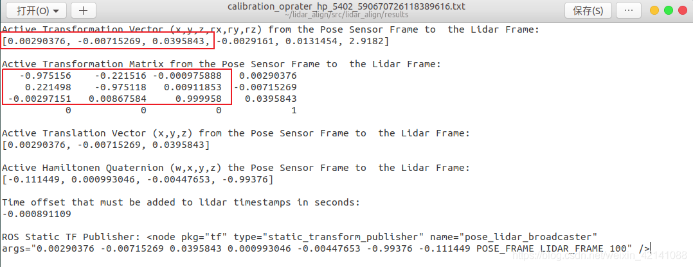
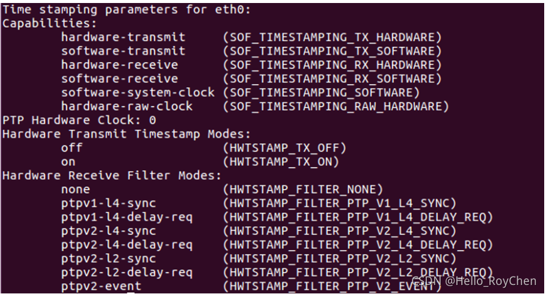
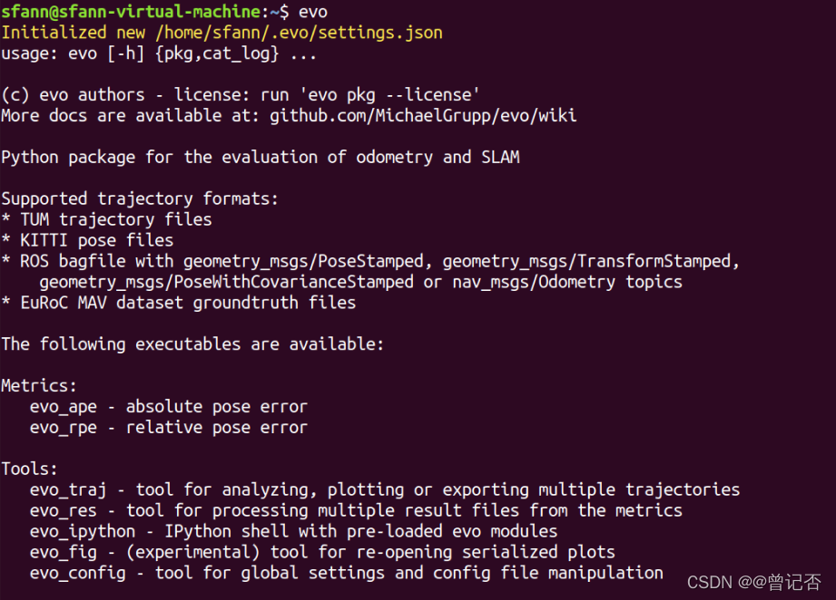
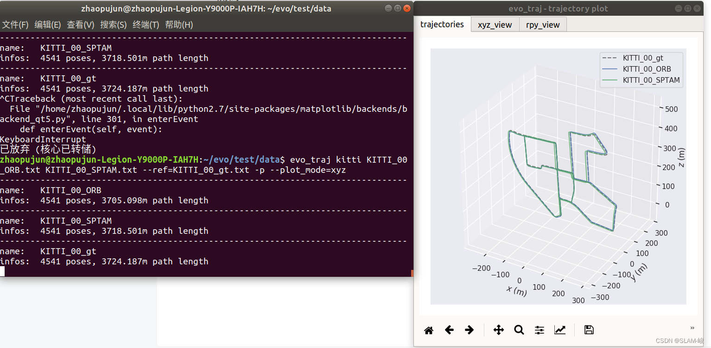

# agv_2023_pkg
> Latest update  --  2023.04.23
> 
> 系统：Ubuntu 18.04
>

## Menu

  - [**功能包简介**](#功能包简介)

  - [**基本配置**](#Basic)

  - [**ROS**](#ROS)

  - [**LIO-SAM**](#LIO-SAM)

  - [**IMU配置**](#IMU) 

  - 标定：[**IMU标定内参**](#IMU标定内参) 、[**Lidar和IMU联合标定**](#Lidar和IMU联合标定)

  - [**Livox**](#Livox)

  - [**Ouster Lidar**](#Ouster_Lidar)

  - [**ZED2相机配置**](#zed-open-capture)

  - [**USB摄像头**](#USB摄像头)
  
  - [**激光避障感知**](#depth_clustering)
  
  - [**GPS相关**](#GPS相关)
  
  - [**EVO-SLAM轨迹对比工具**](#EVO-SLAM轨迹对比工具)


## 功能包简介

> 功能包内相关功能详见pkg里的readme

- sensor_pkg ————传感器功能包
- map_pkg ————地图相关功能包
- control_pkg ————控制功能包
- navigation_pkg ————导航功能包
- SLAM_pkg ————SLAM定位功能包
- networksocket_pkg ————云平台网络连接功能包
- service_pkg ————启动服务功能包
- sensor_run_sh ————启动传感器的sh文件

以下介绍为相关的环境配置文档

## Basic
```
sudo apt-get install git
sudo apt-get install cutecom
sudo apt install -y httpie
```
>USB接口永久权限设置
```
sudo gpasswd -a agv dialout #其中agv是用户名
```
>PCL
```
sudo apt install pcl-tools
```
## ROS
>Install: ROS wiki or Git rostaller

-[ROS Melodic](http://wiki.ros.org/melodic/Installation/Ubuntu)  
-[rostaller](https://github.com/RocShi/rostaller.git)
```
git clone https://github.com/RocShi/rostaller.git
cd rostaller
chmod +x ./run.sh
./run.sh
```
>Environment configuration
```
source /opt/ros/melodic/setup.bash
echo "source /opt/ros/melodic/setup.bash" >> ~/.bashrc
source ~/.bashrc
```
>Related configuration
```
sudo apt-get install ros-melodic-velodyne-pointcloud
```

## LIO-SAM
>Dependent
```
#ros
sudo apt-get install -y ros-melodic-navigation
sudo apt-get install -y ros-melodic-robot-localization
sudo apt-get install -y ros-melodic-robot-state-publisher
#gtsam
sudo add-apt-repository ppa:borglab/gtsam-release-4.0
sudo apt install libgtsam-dev libgtsam-unstable-dev
```
>Package

-[LIO-SAM](https://github.com/TixiaoShan/LIO-SAM.git)

-[LIO-SAM with relocal](https://github.com/Fontainebleau2021/lio_sam_devel.git)
```
cd ~/catkin_ws/src
git clone https://github.com/TixiaoShan/LIO-SAM.git
#or git clone https://github.com/Fontainebleau2021/lio_sam_devel.git
cd ..
catkin_make
```
## IMU
>Supported devices

-[LPMS-IG1 RS232](https://www.alubi.cn/software-support/download/)

>Install 
```
#ros
sudo apt install ros-melodic-openzen-sensor

#or install by package(Not recommended)
cd ~/catskin_ws/src
git clone --recurse-submodules https://bitbucket.org/lpresearch/openzenros.git
cd ..
catkin_make
```
>Run
```
sudo chmod 777 /dev/ttyUSB0
rosrun openzen_sensor openzen_sensor_node
```

>launch文件
建立启动包
```
cd ~/catkin_ws/src
catkin_create_pkg lmps roscpp rospy std_msgs
```
在其中新建一个launch文件夹，并在其中新建一个run.launch文件，内容如下
```
<launch>
<node pkg="openzen_sensor" type="openzen_sensor_node" name="lpms_imu" output="screen" ns="lmps" />
</launch>
```

## IMU标定内参
-[使用imu_utils工具标定imu的内参](https://blog.csdn.net/weixin_53073284/article/details/123341141?ops_request_misc=%257B%2522request%255Fid%2522%253A%2522166599541116800182714192%2522%252C%2522scm%2522%253A%252220140713.130102334..%2522%257D&request_id=166599541116800182714192&biz_id=0&utm_medium=distribute.pc_search_result.none-task-blog-2~all~baidu_landing_v2~default-4-123341141-null-null.142^v58^pc_search_tree,201^v3^control_1&utm_term=imu_utils%E6%A0%87%E5%AE%9A&spm=1018.2226.3001.4187)
>Denpendent
```
sudo apt-get install libdw-dev
```
>Ceres Install

-[Ceres Solver Document](http://ceres-solver.org/installation.html#linux)

-[Ceres Solver Google](https://ceres-solver.googlesource.com/ceres-solver)

依赖安装：
```
# CMake
sudo apt-get install cmake
# google-glog + gflags
sudo apt-get install libgoogle-glog-dev libgflags-dev
# BLAS & LAPACK
sudo apt-get install libatlas-base-dev
# Eigen3
sudo apt-get install libeigen3-dev
# SuiteSparse and CXSparse (optional)
sudo apt-get install libsuitesparse-dev
```
使用
```
git clone https://ceres-solver.googlesource.com/ceres-solver
```
克隆的ceres最新版本与eigen3不匹配需要在上面官网链接的version history下找到ceres1.14.0版本下载并解压到home下。

-[cere 1.14.0](https://github.com/Fontainebleau2021/ceres1.14.0.git)
```
git clone https://github.com/Fontainebleau2021/ceres1.14.0.git
cd ceres1.14.0
mkdir build
cd build
cmake ..
make
sudo make install
```
>code_utils

（imu_utils 依赖 code_utils所以先把code_utils放在工作空间的src下面编译然后再将imu_utils放到src下编译）新建工作空间将下载的code_utils解压放在src下，在imu_utils/src/code_utils/下打开sumpixel_test.cpp文件修改#include "backward.hpp"为 #include “code_utils/backward.hpp

-[code_utils](https://github.com/gaowenliang/code_utils)
```
cd ~/catkin_ws/src
git clone https://github.com/gaowenliang/code_utils
cd ..
catkin_make
```
>imu_utils

-[imu_utils](https://github.com/gaowenliang/imu_utils)

code_utils编译成功后把imu_utils放到工作空间的src下面，进行编译。
```
cd ~/catkin_ws/src
git clone https://github.com/gaowenliang/imu_utils
cd ..
catkin_make
```
>录制imu数据包

<font color='red'> 全程保持imu静止不动 </font>，imu上电运行十分钟后开始录制，录制两个小时。
```
rosbag record -O imu.bag /imu/data
```
>标定imu

<font color='red'> 标定过程imu不要运行！！！ </font>在 imu_utils/src/imu_utils/launch/下找到xsense.launch,修改imu_topic和max_time_min，其中max_time_min两小时就设为120，启动launch文件。
```
source  devel/setup.bash
roslaunch imu_utils xsense.launch
```
播放imu的bag。
```
//-r200:以两百倍速播放imu包
rosbag play -r200  imu.bag
```
播包结束时才会显示标定完成，标定结果在data文件夹下会生成一堆文件我们需要的是第一个标定结束，标定结果存在imu_utils/src/imu_utils/data/下xsense_imu_param.yaml

>liosam参数的相关修改
配置文件生成后的对应关系为：
```
  // Acc误差模型高斯白噪声
  imuAccNoise<---------->acc_n 
  // Gyro误差模型高斯白噪声
  imuGyrNoise<----------> gyr_n
  // Acc误差模型随机游走噪声
  imuAccBiasN<---------->acc_w
  // Gyro误差模型随机游走噪声
  imuGyrBiasN<----------> gyr_w
```

## Lidar和IMU联合标定

使用lidar-align进行联合标定

-[lidar-align](https://github.com/ethz-asl/lidar_align)

参考：

-[激光雷达和IMU联合标定并运行LIOSAM](https://blog.csdn.net/cyx610481953/article/details/115265585)

-[LIO-SAM运行自己数据包遇到的问题解决](https://blog.csdn.net/weixin_42141088/article/details/118000544?ops_request_misc=&request_id=&biz_id=102&utm_term=lio%20sam%20imu%E6%A0%87%E5%AE%9A&utm_medium=distribute.pc_search_result.none-task-blog-2~all~sobaiduweb~default-4-118000544.142^v59^pc_rank_34_queryrelevant25,201^v3^control_1&spm=1018.2226.3001.4187)

>Install
```
cd /catkin_ws/src
git clone https://github.com/ethz-asl/lidar_align.git
catkin_make
```
- 第一次编译会报错nlopt库
```
sudo apt-get install libnlopt-dev
```
将NLOPTConfig.cmake文件移动到 lidar_align/src/ 下,并在CMakeLists.txt里加上这样一句话：
```
list(APPEND CMAKE_FIND_ROOT_PATH ${PROJECT_SOURCE_DIR})
set (CMAKE_PREFIX_PATH "/usr/local/lib/cmake/nlopt")
```
- 第二次编译会报定义冲突问题,依次运行以下指令
```
sudo mv /usr/include/flann/ext/lz4.h /usr/include/flann/ext/lz4.h.bak

sudo mv /usr/include/flann/ext/lz4hc.h /usr/include/flann/ext/lz4.h.bak

sudo ln -s /usr/include/lz4.h /usr/include/flann/ext/lz4.h

sudo ln -s /usr/include/lz4hc.h /usr/include/flann/ext/lz4hc.h

catkin_make
```
- 编译成功后，改写IMU接口。因为这一工具原本不是用来标定激光雷达和IMU的而是用来标定激光雷达和里程计的。所以需要改写IMU接口来替换掉里程计接口。打开loader.cpp文件：
```
//找到以下odom部分注释删掉都可
/*  types.push_back(std::string("geometry_msgs/TransformStamped"));
  rosbag::View view(bag, rosbag::TypeQuery(types));

  size_t tform_num = 0;
  for (const rosbag::MessageInstance& m : view) {
    std::cout << " Loading transform: \e[1m" << tform_num++
              << "\e[0m from ros bag" << '\r' << std::flush;

    geometry_msgs::TransformStamped transform_msg =
        *(m.instantiate<geometry_msgs::TransformStamped>());

    Timestamp stamp = transform_msg.header.stamp.sec * 1000000ll +
                      transform_msg.header.stamp.nsec / 1000ll;

    Transform T(Transform::Translation(transform_msg.transform.translation.x,
                                       transform_msg.transform.translation.y,
                                       transform_msg.transform.translation.z),
                Transform::Rotation(transform_msg.transform.rotation.w,
                                    transform_msg.transform.rotation.x,
                                    transform_msg.transform.rotation.y,
                                    transform_msg.transform.rotation.z));
    odom->addTransformData(stamp, T);
  }
*/

//将以上部分替换为：

	types.push_back(std::string("sensor_msgs/Imu"));
	rosbag::View view(bag, rosbag::TypeQuery(types));
	size_t imu_num = 0;
	double shiftX=0,shiftY=0,shiftZ=0,velX=0,velY=0,velZ=0;
	ros::Time time;
	double timeDiff,lastShiftX,lastShiftY,lastShiftZ;
	for (const rosbag::MessageInstance& m : view){
	  std::cout <<"Loading imu: \e[1m"<< imu_num++<<"\e[0m from ros bag"<<'\r'<< std::flush;

	  sensor_msgs::Imu imu=*(m.instantiate<sensor_msgs::Imu>());

	  Timestamp stamp = imu.header.stamp.sec * 1000000ll +imu.header.stamp.nsec / 1000ll;
	  if(imu_num==1){
		 time=imu.header.stamp;
			 Transform T(Transform::Translation(0,0,0),Transform::Rotation(1,0,0,0));
		 odom->addTransformData(stamp, T);
	 }
	 else{
		 timeDiff=(imu.header.stamp-time).toSec();
		 time=imu.header.stamp;
		 velX=velX+imu.linear_acceleration.x*timeDiff;
		 velY=velX+imu.linear_acceleration.y*timeDiff;
		 velZ=velZ+(imu.linear_acceleration.z-9.801)*timeDiff;

		 lastShiftX=shiftX;
		 lastShiftY=shiftY;
		 lastShiftZ=shiftZ;
		 shiftX=lastShiftX+velX*timeDiff+imu.linear_acceleration.x*timeDiff*timeDiff/2;
		 shiftY=lastShiftY+velY*timeDiff+imu.linear_acceleration.y*timeDiff*timeDiff/2;
		 shiftZ=lastShiftZ+velZ*timeDiff+(imu.linear_acceleration.z-9.801)*timeDiff*timeDiff/2;

		 Transform T(Transform::Translation(shiftX,shiftY,shiftZ),
				Transform::Rotation(imu.orientation.w,
						 imu.orientation.x,
						 imu.orientation.y,
						 imu.orientation.z));
		 odom->addTransformData(stamp, T);
	 }
	}

//并在开头添加头文件：

#include <sensor_msgs/Imu.h>
```
>录制数据以及标定
需同时录制激光雷达和IMU两分钟即可，最好将数据量控制到2G以内，超出2G之外可能出现未知错误无法标定。两分钟的数据应该尽量包含较大的旋转量和平移量（也就是先直线跑一段再转两圈），这样标出来的误差结果比较好。

打开lidar_align.launch文件，将两分钟的数据包路经copy输入进去。改写了接口以后就不用以表格形式导入数据了，直接播放在launch文件里面修改你的数据包的路径即可。标定时间可能较长，一个小时多点吧，需要迭代将近300次左右
```
source devel/setup.bash
roslaunch lidar_align lidar_align.launch
```
最后标定的结果文件存放在lidar-align的results文件夹下的calibration文件中。

>liosam参数的相关修改

在相应的calibration文件中找到以下参数：
<p align='center'>
    
</p>
将上述方框标注的参数对应写到下方配置文件中：

```
  extrinsicTrans: [0.00290376, -0.00715269, 0.0395843]
  
  extrinsicRot: [-0.975156 ,-0.221516 ,-0.000975888,
                  0.221498  ,-0.975118 , 0.00911853,
                 -0.00297151 ,0.00867584 ,0.999958]
  extrinsicRPY: [-0.975156 ,-0.221516 ,-0.000975888,
                  0.221498  ,-0.975118 , 0.00911853,
                 -0.00297151 ,0.00867584 ,0.999958]
```

## Livox
### 硬件使用：

连接网线后设置静态IP：

更改ipv4为：192.168.1.50，子网掩码设置为：255.255.255.0

### 软件使用：

-[Livox SDK](https://github.com/Livox-SDK/Livox-SDK.git)

-[Livox ROS Driver](https://github.com/Livox-SDK/livox_ros_driver.git)

>Livox SDK Install
```
sudo apt install cmake
git clone https://github.com/Livox-SDK/Livox-SDK.git
cd Livox-SDK
cd build && cmake ..
make
sudo make install
```
>Livox ROS Driver
```
cd ~/catkin_ws/src
git clone https://github.com/Livox-SDK/livox_ros_driver.git
cd ..
catkin_make
# Run
source devel/setup.bash
roslaunch livox_ros_driver [launch file] [param]
# Rviz
roslaunch livox_ros_driver livox_lidar_rviz.launch
# Without Rviz
roslaunch livox_ros_driver livox_lidar.launch
```
其中launch file表格如下

| launch 文件名             | 功能                                                         |
| ------------------------- | ------------------------------------------------------------ |
| livox_lidar_rviz.launch   | 连接览沃雷达设备<br>向外发布 pointcloud2 格式的点云数据<br>自动加载rviz |
| livox_hub_rviz.launch     | 连接览沃中心板设备<br>向外发布 pointcloud2 格式的点云数据<br>自动加载rviz |
| livox_lidar.launch        | 连接览沃雷达设备<br>向外发布 pointcloud2 格式的点云数据    |
| livox_hub.launch          | 连接览沃中心板设备<br>向外发布 pointcloud2 格式的点云数据  |
| livox_lidar_msg.launch    | 连接览沃雷达设备<br>向外发布览沃自定义点云数据             |
| livox_hub_msg.launch      | 连接览沃中心板设备<br/>向外发布览沃自定义点云数据           |
| lvx_to_rosbag.launch      | 转换 lvx 文件为 rosbag 文件<br>直接将 lvx 文件转换为 rosbag 文件 |
| lvx_to_rosbag_rviz.launch | 转换 lvx 文件为 rosbag 文件<br>从 lvx 文件中读取点云数据，并转换为 pointcloud2 格式向外发布 |

>Livox时间戳问题--Ros中需要UNIX格式的时间

-[Livox 激光雷达时间同步](https://blog.csdn.net/weixin_45024226/article/details/120063944)

通过ptpd修改网口输出的时间格式。首先通过ethtool查看网口的配置，例如连接了livox的网口为eno1，则：
```
sudo apt install ethtool
ethtool -T eno1
```
如果出现
```
 `hardware-raw-clock (SOF_TIMESTAMPING_RAW_HARDWARE)`
 `hardware-transmit (SOF_TIMESTAMPING_TX_HARDWARE)`
 `hardware-recive (SOF_TIMESTAMPING_RX_HARDWARE)`
 ```
<p align='center'>
    
</p>

说明可以进行硬件时间同步。通过ptpd工具修改：

```
sudo apt install ptpd
sudo ptpd -M -i eno1 -C 
```
当出现best master的时候，说明成功。可以使用下列指令查看当前点云的时间戳内容：
```
rostopic echo /livox_lidar | grep "secs"
```

>添加Livox_repub
```
git clone https://github.com/kamibukuro5656/livox_velodyne_format_repub.git
```
在livox的launch文件夹中copy一个livox_lidar_msg.launch文件，并在开头增加语句：
```
<node pkg="velodyne_style_repub" type="velodyne_style_repub" name="livox_repub" output="screen" />
```


## Ouster_Lidar

### 硬件使用：

连接网线后设置静态IP：

更改ipv4为：192.0.2.1，子网掩码设置为：255.255.255.0

### 软件使用

-[Ouster Studio 下载](https://ouster.com/zh-cn/downloads/)

Ouster Studio 启动可能需要的依赖：
```
sudo apt-get install libpython3.7
```
-[Ouster 驱动(github)](https://github.com/ouster-lidar/ouster_example)
>Dependent
```
sudo apt install build-essential cmake libeigen3-dev libjsoncpp-dev
sudo apt install ros-melodic-ros-core ros-melodic-pcl-ros ros-melodic-tf2-geometry-msgs ros-melodic-rviz
```
>Install
```
git clone https://github.com/ouster-lidar/ouster_example.git
mkdir catkin_ws
cd catkin_ws
mkdir src
ln -s <path to ouster_example> ./src/
catkin_make -DCMAKE_BUILD_TYPE=Release
```
其中，最新版本的ouster驱动可能没有ouster_ros,需要去下载旧版本

-[ouster_lidar 旧版本驱动](https://github.com/Fontainebleau2021/ouster_lidar.git)
```
git clone https://github.com/Fontainebleau2021/ouster_lidar.git
mkdir catkin_ws
cd catkin_ws
mkdir src
ln -s <path to ouster_example> ./src/
catkin_make -DCMAKE_BUILD_TYPE=Release
```
>Run
```
source ./devel/setup.bash
roslaunch ouster_ros sensor.launch sensor_hostname:=os-122149001448.local lidar_mode:=1024x10 viz:=true metadata:=$PWD/metadata.json
```
>ROS下的设置

需要将ouster_ros中的sensor.launch文件中的timestamp_mode设置为TIME_FROM_ROS_TIME的格式
```
<arg name="timestamp_mode" default="" doc="method used to timestamp measurements; possible values: {
    TIME_FROM_INTERNAL_OSC,
    TIME_FROM_SYNC_PULSE_IN,
    TIME_FROM_PTP_1588,
    TIME_FROM_ROS_TIME
    }"/>
```

## zed-open-capture

### Description

The ZED Open Capture is a multi-platform, open-source C++ library for low-level camera and sensor capture for the ZED stereo camera family. It doesn't require CUDA and therefore can be used on many desktop and embedded platforms.

The open-source library provides methods to access raw video frames, calibration data, camera controls and raw data from the camera sensors (on ZED 2 and ZED Mini). A synchronization mechanism is provided to get the correct sensor data associated to a video frame.

**Note:** While in the ZED SDK all output data is calibrated and compensated, here the extracted raw data is not corrected by the camera and sensor calibration parameters. You can retrieve camera and sensor calibration data using the [ZED SDK](https://www.stereolabs.com/docs/video/camera-calibration/) to correct your camera data.


#### Prerequisites

 * Stereo camera: [ZED 2](https://www.stereolabs.com/zed-2/), [ZED](https://www.stereolabs.com/zed/), [ZED Mini](https://www.stereolabs.com/zed-mini/)
 * Linux OS
 * GCC (v7.5+)
 * CMake (v3.1+)

#### Install prerequisites

The code is implemented majorly based on [ROS melodic](https://www.ros.org/)
* Install ROS Melodic according to [ROS official instructions](http://wiki.ros.org/melodic/Installation/Ubuntu). Additionally, install `apriltag-ros` dependency with following step.

    `$ sudo apt-get install ros-melodic-apriltag`

* Install GCC compiler and build tools

    `$ sudo apt install build-essential`

* Install CMake build system

    `$ sudo apt install cmake`

* Install HIDAPI and LIBUSB libraries:

    `$ sudo apt install libusb-1.0-0-dev libhidapi-libusb0 libhidapi-dev`

* Install OpenCV to build the examples (optional)

    `$ sudo apt install opencv-dev`

####  Launch

	$ catkin build
	$ source devel/setup.bash
	$ roslaunch zed-open-capture zed2_capture.launch

## USB摄像头
>查看USB摄像头设备
```
ls /dev/video*
```
>查看图像

（1）使用应用程序camorama
```
#Install
sudo apt-get install camorama

#Run
camorama 
camorama -d /dev/video1 #指定打开设备video1
```
（2）使用应用程序茄子（cheese）
```
#Install
sudo apt-get install cheese

#Run
cheese
cheese -d /dev/video1 #指定打开设备video1
```
>查看USB摄像头参数
```
#Install
sudo apt-get install v4l-utils

#Run
v4l2-ctl -d  /dev/video0 --all #查看设备video0的参数
```
> ROS下连接USB摄像头
```
cd ~/catkin_ws/src
git clone https://github.com/bosch-ros-pkg/usb_cam.git usb_cam
cd ..
catkin_make -DCATKIN_WHITELIST_PACKAGES=usb_cam
```
打开launch文件，设置USB摄像头的编号：
```
 <param name="video_device" value="/dev/video0" />
```
启动：
```
roslaunch usb_cam usb_cam-test.launch
```

## depth_clustering

-[depth_clustering](https://github.com/PRBonn/depth_clustering)

-[激光聚类算法-depth_clustering安装运行](https://blog.csdn.net/qq_40216084/article/details/108703496)

>Depentent
```
sudo apt install libopencv-dev libqglviewer-dev-qt5 freeglut3-dev qtbase5-dev
```
>Install
```
cd ~/catkin_ws/src
git clone https://github.com/PRBonn/depth_clustering src/depth_clustering
cd depth_clustering
mkdir build
cd build
cmake ..
make -j4
ctest -VV  # run unit tests, optional
```
>Testing dataset
```
cd ~/catkin_ws/src/depth_clustering
mkdir data/; wget http://www.mrt.kit.edu/z/publ/download/velodyneslam/data/scenario1.zip -O data/moosmann.zip; unzip data/moosmann.zip -d data/; rm data/moosmann.zip
```
下载下来的数据是.png格式的，都是深度图，总共110M左右。运行测试：
```
cd depth_clustering/build/devel/lib/depth_clustering/
./qt_gui_app #运行可视化界面
```
点击open_folder，选择刚才下载的数据目录，然后点击play，运行。

>ros环境

使用catkin_tools进行编译
```
sudo apt install python3-pip
sudo python3 -m pip install --upgrade --force-reinstall pip
sudo pip install catkin_tools
cd ~/catkin_ws
catkin build
```
注意对已编译的功能包要使用catkin build命令。

show_objects_node订阅了/velodyne_points的点云话题，运行：
```
cd catkin_depth
source devel/setup.bash
rosrun depth_clustering show_objects_node --num_beams 16 --angle 10
```

## GPS相关
>硬件相关
- 安装要求：蘑菇头上放不要有遮挡，安装位置的距离在1.2m效果最好（小车前进方向左右对称）
- 数据传输：通过VGA口进行数据传输（如果工控机没有VGA口需要准备VGA转USB连接线）
>软件相关
- GPS_pkg中：
  - gps_viewer——显示GPS轨迹:
    - 订阅话题：/fix （/NavSatFix格式）
    - 输出话题：/gps_path（/Path格式）
    - 没有rviz自动显示
  - imu_gps_localization——基于卡尔曼滤波的IMU和GPS联合定位:
  - nmea_navsat_driver——GPS相关驱动
  - 注意：如果后续运行过程中发现缺少nmea_navsat_driver驱动，可以使用下面的命令手动安装：
```
sudo apt-get install ros-****-nmea-navsat-driver libgps-dev
#其中****为ubuntu版本，例如melodic版本的安装命令为：
sudo apt-get install ros-melodic-nmea-navsat-driver libgps-dev
```
- 需要测试的相关工具
  - cutecom
```
#安装
sudo apt-get install cutecom
#界面使用
cutecom
```
>GPS实机相关操作

（1）连接GPS实机使用

1、使用cutecom来确定GPS通信的串口号，需要在setting中将波特率设置为115200，输入数据的格式需要改为CR/LF（例如在下述例子中，得到的GPS通信的串口号为/dev/ttyUSB0）

2、可以通过使用cutecom发送命令改变GPS的信号传输频率（联适GPS默认频率为1Hz），例如将GPS的信号传输频率改为10Hz的命令为：LOG GPGGA ON TIME 0.1

3、使用命令从串口读取nmea格式的GPS字符段并发布话题/nmea_sentence（/nmea_msgs/Sentence格式）：
```
rosrun nmea_navsat_driver nmea_topic_serial_reader _port:=/dev/ttyUSB0 _baud:=115200
```

4、使用nmea_navsat_driver驱动中的节点接收话题/nmea_sentence（/nmea_msgs/Sentence格式）并发布/fix话题（/NavSatFix格式）：
```
rosrun nmea_navsat_driver nmea_topic_driver
```

5、打开gps_viewer和Rviz节点，并在Rviz界面中添加/gps_path数据（可视化）：
```
rosrun gps_viewer gps_viewer
rosrun rviz rviz
```
- 其中注意Rviz中的frame，需要和gps_viewer发布的话题frame一致

（2）离线bag操作

1、检查bag中GPS信号的话题格式

2、参照（1）中的4、5进行离线测试

## EVO-SLAM轨迹对比工具
>安装evo

因为ros依赖的python版本是2.7，目前最新版本的evo是支持python3.7+，在ubuntu18.04中建议通过源码安装evo。
```
python --version  //确认当前python版本是否为2，若为3建议手动切换到2在进行安装
```
（注意python和pip下载的对应关系，python2.7就用pip，python3用pip3，evo1.1.2用pip，evo高版本用pip3 ；注意ros只支持python2）
```
git clone https://github.com/MichaelGrupp/evo.git
#下载git包
cd evo
git checkout v1.12.0
#检查
sudo pip install  -i https://pypi.tuna.tsinghua.edu.cn/simple --editable . --upgrade --no-binary evo 
#解决下载慢的问题（镜像）（我这里找不到命令，所以前面加了sudo）
```

>测试evo

（1）命令行输入evo，现实如下：
<p align='center'>
    
</p>
（2）
通过源码包下自带的.txt测试文件
```
cd test/data
evo_traj kitti KITTI_00_ORB.txt KITTI_00_SPTAM.txt --ref=KITTI_00_gt.txt -p --plot_mode=xyz
```
安装成功页面：
<p align='center'>
    
</p>